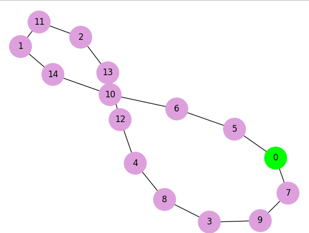

# ia-hill-climbing
Este código implementa uma solução para o Problema do Caixeiro Viajante (TSP - Travelling Salesman Problem) utilizando o algoritmo de Subida da Encosta (Hill Climbing). O problema consiste em encontrar o menor caminho possível que visita uma série de cidades e retorna ao ponto de origem, visitando cada cidade apenas uma vez.

## Input
A entrada deste algoritmo é um array bidimensional com as coordenadas das cidades. Por exemplo:

```
coordinate = np.array([[1,2], [30,21], [56,23], [8,18], [20,50], [3,4], [11,6], [6,7], [15,20], [10,9], [12,12], [46,17], [60,55], [100,80], [16,13]])
```

## Output
A saída do algoritmo é uma lista de inteiros que indica a ordem dos números das cidades e o comprimento do caminho. Por exemplo:

```
A solução é: [3, 7, 5, 0, 6, 9, 10, 14, 8, 1, 11, 2, 13, 12, 4] 

O comprimento do caminho é: 283.8355158499078
 ```



## Como executar
O código imprimirá informações sobre a busca, incluindo a distância total da rota e a aptidão ao longo das iterações.

 - Salve o código como um arquivo Python (e.g., index.py).
 - Instale as dependências com pip install -r requirements.txt.
 - Abra um terminal ou prompt de comando e navegue até o diretório onde o arquivo está salvo.
 - Execute o código usando o comando python index.py.
